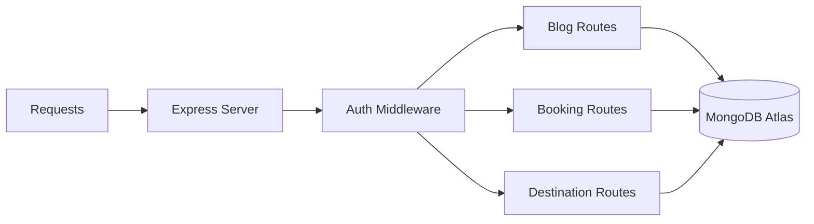

A production-ready RESTful API built with Node.js, Express, and MongoDB.

**Live API**: [https://travel-ai-pro-backend.onrender.com](https://travel-ai-pro-backend.onrender.com)

---

## 🏗️ Backend Architecture



### 📝 Blog Data Flow
When a blog is created or updated, it follows this path:
1. **Validation**: Checks for required fields (title, slug, content).
2. **Schema Logic**: Auto-generates timestamps and enforces unique slugs.
3. **Database**: Persists to MongoDB Atlas.

---

## 🚀 Installation & Setup

### 1. Prerequisites
- Node.js (v18+)
- MongoDB Atlas account

### 2. Install Dependencies
```bash
cd Backend
npm install
```

### 3. Environment Variables
Create a `.env` file (or configure in `index.js`):
- `PORT`: 5000
- `MONGODB_URI`: Your MongoDB Connection String
- `JWT_SECRET`: Your Security Key

### 4. Run Development Server
```bash
npm run dev
```
The API will be available at `http://localhost:5000/api` (Local) or `https://travel-ai-pro-backend.onrender.com/api` (Production)

---

## 🛠️ Tech Stack
- **Runtime**: Node.js
- **Framework**: Express.js
- **Database**: MongoDB with Mongoose
- **Security**: JWT & BcryptJS
- **Dev Tools**: Nodemon for auto-restarts

---

## 👤 Author
**Shreyash Patil**
*Backend Architecture Specialist*

---

## 📄 License
This project is licensed under the MIT License.
