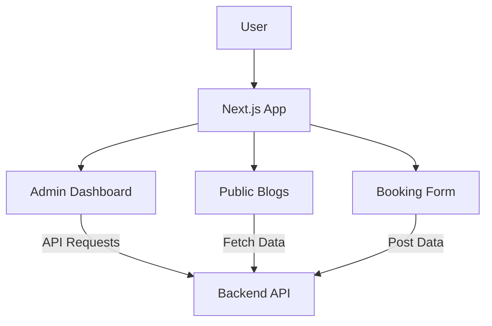

# Travel AI Pro - Premium Tourism Frontend

**Live Website**: [https://travel-ai-pro.onrender.com](https://travel-ai-pro.onrender.com)

The official Next.js 15 frontend for the Travel AI Pro platform. Featuring a glassmorphic design, fluid animations, and a seamless admin dashboard.

---

## 🎨 Frontend Architecture



### 🖋️ Blog Management
1. **Admin Panel**: Secure interface for creating and editing travel stories.
2. **Slug System**: Dynamic routing based on unique URL slugs.
3. **Markdown**: Supports rich text content for travel guides.

---

## 🚀 Installation & Setup

### 1. Prerequisites
- Node.js (v18+)
- Backend API running on port 5000

### 2. Install Dependencies
```bash
cd "Travel AI Pro"
npm install
```

### 3. Environment Configuration
Create a `.env.local` file:
```env
NEXT_PUBLIC_API_URL=https://travel-ai-pro-backend.onrender.com
```

### 4. Run Development Server
```bash
npm run dev
```
The application will be live at `http://localhost:3000` (Local) or `https://travel-ai-pro.onrender.com` (Production)

---

## ✨ Key Features
- **Premium UI**: Framer Motion animations and Tailwind CSS styling.
- **Responsive**: Fully optimized for Mobile, Tablet, and Desktop.
- **Admin Suite**: Complete blog CRUD (Create, Read, Update, Delete) functionality.
- **Performance**: Static site generation and optimized image loading.

---

## 👤 Author
**Shreyash Patil**
*Premium Experience Developer*

---

## 📄 License
This project is licensed under the MIT License.
